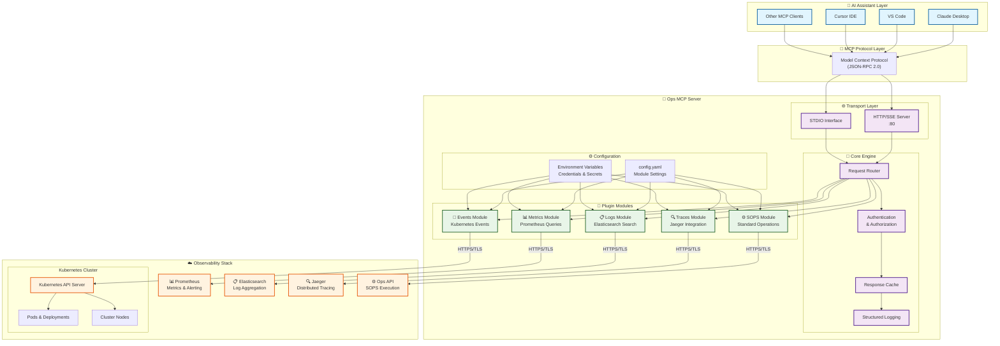

# Ops MCP Server

🚀 **Enterprise-Grade AI Operations Assistant** - A comprehensive Model Context Protocol (MCP) server that bridges AI assistants with your entire observability stack.

## 🎯 Project Vision

**Transform AI assistants into intelligent operations engineers** by providing seamless access to your Kubernetes clusters, monitoring systems, logging infrastructure, and operational procedures through a unified, secure, and scalable MCP interface.

## 📋 Project Overview

Ops MCP Server is a production-ready, Go-based MCP server that empowers AI assistants (Claude, VS Code, Cursor, etc.) to become your intelligent operations co-pilot. By implementing the Model Context Protocol standard, it provides a secure, unified gateway to your entire observability ecosystem:

- **🔍 Real-time Kubernetes Operations**: Monitor pods, deployments, nodes, and cluster events
- **📊 Advanced Metrics Intelligence**: Query Prometheus metrics with natural language
- **📋 Comprehensive Log Analysis**: Search and analyze logs across Elasticsearch clusters  
- **🔧 Automated Operations**: Execute standard operating procedures (SOPS) safely
- **🌐 Distributed Tracing**: Investigate performance issues with Jaeger integration

## 🏗️ System Architecture



## ✨ Key Features

### 🏗️ Enterprise-Ready Architecture

- **🔒 Security-First Design**: Role-based access control, secure credential management, and audit logging
- **⚡ High Performance**: Built with Go 1.24.2, optimized for low latency and high throughput
- **🔄 Multi-Protocol Support**: HTTP/SSE and stdio modes for flexible deployment scenarios
- **📈 Scalable & Reliable**: Production-tested with comprehensive error handling and retry mechanisms
- **🎛️ Highly Configurable**: YAML-based configuration with environment variable support

### 🧩 Modular Plugin System

- **⚙️ SOPS Module**: Execute standardized operational procedures with safety checks and rollback capabilities
- **🎯 Events Module**: Real-time Kubernetes event monitoring with intelligent filtering and correlation
- **📊 Metrics Module**: Advanced Prometheus querying with natural language processing capabilities
- **📋 Logs Module**: Powerful Elasticsearch integration with full-text search and log aggregation
- **🔍 Traces Module**: Distributed tracing analysis with Jaeger integration for performance optimization

### 🤖 AI-Native Design

- **🧠 Intelligent Context**: Provides rich metadata and context to AI assistants for better decision-making
- **💬 Natural Language Interface**: Converts complex queries into simple, conversational interactions
- **🔄 Real-time Updates**: Live data streaming for immediate operational insights
- **📊 Smart Aggregation**: Intelligent data summarization and trend analysis

## 🛠️ Available Tools

The server exposes a comprehensive suite of MCP tools, each designed for specific operational tasks:

### ⚙️ Standard Operations (SOPS)

| Tool | Description | Use Case |
|------|-------------|----------|
| `execute-sops` | Execute standardized operational procedures with safety checks | Infrastructure management, automated deployments, maintenance tasks |

### 🎯 Kubernetes Events

| Tool | Description | Use Case |
|------|-------------|----------|
| `get-pod-events` | Retrieve real-time events from pods across namespaces/clusters | Pod troubleshooting, deployment monitoring, resource issues |
| `get-deployment-events` | Monitor deployment lifecycle events and status changes | Release tracking, rollback decisions, scaling operations |
| `get-node-events` | Track node-level events and cluster health indicators | Node maintenance, capacity planning, hardware issues |

### 📊 Prometheus Metrics

| Tool | Description | Use Case |
|------|-------------|----------|
| `list-metrics` | Discover available metrics and their metadata | Metric exploration, dashboard creation, alerting setup |
| `query-metrics` | Execute instant PromQL queries for real-time data | Performance monitoring, SLA tracking, capacity analysis |
| `query-metrics-range` | Run time-series queries for historical analysis | Trend analysis, capacity planning, performance optimization |

### 📋 Elasticsearch Logs

| Tool | Description | Use Case |
|------|-------------|----------|
| `search-logs` | Full-text search across all log messages | Error investigation, security analysis, compliance auditing |
| `list-log-indices` | Discover available log indices and their structure | Log management, retention policies, index optimization |
| `get-pod-logs` | Retrieve logs from specific Kubernetes pods | Application debugging, performance analysis, error tracking |

### 🔍 Distributed Tracing

| Tool | Description | Use Case |
|------|-------------|----------|
| `get-services` | List all available services in the tracing system | Service discovery, architecture analysis, dependency mapping |
| `get-operations` | Retrieve available operations with span kinds | API analysis, performance profiling, service optimization |
| `get-trace` | Fetch complete trace details by trace ID | Root cause analysis, performance bottleneck identification |
| `find-traces` | Search traces based on various criteria | Error investigation, performance analysis, user journey tracking |

### Tool Naming Convention

Tools use a consistent naming convention with **hyphens** as separators:

- **Format**: `{prefix}{verb-noun-context}{suffix}`
- **Examples**: `get-pod-events`, `list-metrics`, `search-logs`
- **Configurable**: Prefix and suffix can be customized for each module

## Configuration

Configure the server using a YAML file (default path: `configs/config.yaml`):

```yaml
# Logging configuration
log:
  level: info # Log level: debug, info, warn, error

# Server configuration
server:
  host: 0.0.0.0 # Server binding address
  port: 80 # Server port
  mode: sse # Server mode: stdio or sse

# SOPS module configuration
sops:
  enabled: true # Whether to enable SOPS module
  tools:
    prefix: "" # Tool name prefix
    suffix: "-from-ops" # Tool name suffix
  ops:
    endpoint: "https://ops-server.your-company.com" # SOPS API endpoint
    token: "${SOPS_TOKEN}" # API token (supports environment variables)

# Events module configuration
events:
  enabled: true # Whether to enable events module
  tools:
    prefix: "" # Tool name prefix
    suffix: "-from-ops" # Tool name suffix
  ops:
    endpoint: "https://ops-server.your-company.com" # Events API endpoint
    token: "${EVENTS_OPS_TOKEN}" # API token (supports environment variables)

# Metrics module configuration
metrics:
  enabled: true # Whether to enable metrics module
  tools:
    prefix: "" # Tool name prefix
    suffix: "-from-prometheus" # Tool name suffix
  prometheus:
    endpoint: "https://prometheus.your-company.com" # Prometheus endpoint
    timeout: 30 # Request timeout (seconds)

# Logs module configuration
logs:
  enabled: true # Whether to enable logs module
  tools:
    prefix: "" # Tool name prefix
    suffix: "-from-elasticsearch" # Tool name suffix
  elasticsearch:
    endpoint: "https://elasticsearch.your-company.com" # Elasticsearch endpoint
    username: "${LOGS_ELASTICSEARCH_USERNAME}" # Username (supports environment variables)
    password: "${LOGS_ELASTICSEARCH_PASSWORD}" # Password (supports environment variables)
    timeout: 30 # Request timeout (seconds)

# Traces module configuration
traces:
  enabled: true # Whether to enable traces module
  tools:
    prefix: "" # Tool name prefix
    suffix: "-from-jaeger" # Tool name suffix
  jaeger:
    endpoint: "https://jaeger.your-company.com" # Jaeger API endpoint
    timeout: 30 # Request timeout (seconds)
```

### Environment Variables

Set the following environment variables in production:

**Note**: 
- Command line flags take precedence over environment variables. If both are specified, the command line flag value will be used.
- By default, all modules are **disabled**. You need to explicitly enable modules using either command line flags or environment variables.

```bash
# Module enablement (default: all disabled)
export SOPS_ENABLED="true"
export EVENTS_ENABLED="true"
export METRICS_ENABLED="true"
export LOGS_ENABLED="true"
export TRACES_ENABLED="true"

# SOPS API configuration
export SOPS_OPS_ENDPOINT="https://ops-server.your-company.com"
export SOPS_OPS_TOKEN="your-sops-api-token"

# Events API configuration
export EVENTS_OPS_ENDPOINT="https://ops-server.your-company.com"
export EVENTS_OPS_TOKEN="your-events-api-token"

# Traces configuration
export TRACES_JAEGER_ENDPOINT="https://jaeger.your-company.com"
export TRACES_JAEGER_TIMEOUT="30"

# Elasticsearch configuration
export LOGS_ELASTICSEARCH_USERNAME="elastic"
export LOGS_ELASTICSEARCH_PASSWORD="your-elasticsearch-password"


# Optional: Prometheus authentication
# export PROMETHEUS_TOKEN="your-prometheus-token"

# Server configuration
export SERVER_HOST="0.0.0.0"
export SERVER_PORT="80"
export LOG_LEVEL="info"
```

### Tool Name Configuration Examples

With the above configuration, the actual tool names will be:

#### SOPS Tools

- `execute-sops-from-ops`

#### Events Tools

- `get-pod-events-from-ops`
- `get-deployment-events-from-ops`
- `get-node-events-from-ops`

#### Metrics Tools

- `list-metrics-from-prometheus`
- `query-metrics-from-prometheus`
- `query-metrics-range-from-prometheus`

#### Logs Tools

- `search-logs-from-elasticsearch`
- `list-log-indices-from-elasticsearch`
- `get-pod-logs-from-elasticsearch`

#### Traces Tools

- `get-services-from-jaeger`
- `get-operations-from-jaeger`
- `get-trace-from-jaeger`
- `find-traces-from-jaeger`

To use default tool names (no prefix/suffix), set both `prefix` and `suffix` to empty strings `""`.

## Usage Guide

### Tool Call Examples

You can call tools with parameters (using the actual configured tool names):

```javascript
// Execute SOPS procedure
const sopsResult = await mcpClient.callTool("execute-sops-from-ops", {
  sops_id: "deploy-application",
  parameters: '{"app_name": "my-app", "version": "v1.2.3"}',
  timeout: "30m",
  dry_run: "false",
});

// Get Pod events
const events = await mcpClient.callTool("get-pod-events-from-ops", {
  cluster: "production",
  namespace: "ai-nlp-fcheck",
  limit: "20",
});

// Execute metrics query
const result = await mcpClient.callTool("query-metrics-from-prometheus", {
  query: "count by (cluster) (up)",
});

// Search logs
const logs = await mcpClient.callTool("search-logs-from-elasticsearch", {
  search_term: "error",
  limit: "50",
  time_range: "1h",
});

// Query traces
const traces = await mcpClient.callTool("find-traces-from-jaeger", {
  service: "my-service",
  operation: "my-operation",
  limit: "10",
});
```

### Claude Desktop Integration Example

Using this MCP server in Claude Desktop:

```json
{
  "mcpServers": {
    "ops-mcp-server": {
      "command": "docker",
      "args": [
        "run",
        "--rm",
        "-i",
        "--env",
        "SOPS_ENABLED=true",
        "--env",
        "SOPS_OPS_ENDPOINT=https://ops-server.your-company.com",
        "--env",
        "SOPS_OPS_TOKEN=your-sops-token",
        "--env",
        "EVENTS_ENABLED=true",
        "--env",
        "EVENTS_OPS_ENDPOINT=https://ops-server.your-company.com",
        "--env",
        "EVENTS_OPS_TOKEN=your-events-token",
        "--env",
        "METRICS_ENABLED=true",
        "--env",
        "LOGS_ENABLED=true",
        "--env",
        "LOGS_ELASTICSEARCH_USERNAME=elastic",
        "--env",
        "LOGS_ELASTICSEARCH_PASSWORD=your-password",
        "--env",
        "TRACES_ENABLED=true",
        "--env",
        "TRACES_JAEGER_ENDPOINT=https://jaeger.your-company.com",
        "--env",
        "TRACES_JAEGER_TIMEOUT=30",
        "shaowenchen/ops-mcp-server:latest",
        "--enable-sops",
        "--enable-events",
        "--enable-metrics",
        "--enable-logs",
        "--enable-traces"
      ]
    }
  }
}
```

## Running the Server

### Docker Container (Recommended)

#### Docker Quick Start

```bash
# Run with default configuration
docker run -d \
  --name ops-mcp-server \
  -p 80:80 \
  -e SOPS_ENABLED="true" \
  -e SOPS_OPS_ENDPOINT="https://ops-server.your-company.com" \
  -e SOPS_OPS_TOKEN="your-sops-api-token" \
  -e EVENTS_ENABLED="true" \
  -e EVENTS_OPS_ENDPOINT="https://ops-server.your-company.com" \
  -e EVENTS_OPS_TOKEN="your-events-api-token" \
  -e METRICS_ENABLED="true" \
  -e LOGS_ENABLED="true" \
  -e LOGS_ELASTICSEARCH_USERNAME="elastic" \
  -e LOGS_ELASTICSEARCH_PASSWORD="your-elasticsearch-password" \
  -e TRACES_ENABLED="true" \
  -e TRACES_JAEGER_ENDPOINT="https://jaeger.your-company.com" \
  -e TRACES_JAEGER_TIMEOUT="30" \
  shaowenchen/ops-mcp-server:latest \
  --mode=sse --enable-sops --enable-events --enable-metrics --enable-logs --enable-traces
```

#### Docker with Custom Configuration

```bash
# Run with custom configuration file
docker run -d \
  --name ops-mcp-server \
  -p 80:80 \
  -v $(pwd)/configs/config.yaml:/runtime/configs/config.yaml \
  -e SOPS_ENABLED="true" \
  -e SOPS_OPS_ENDPOINT="https://ops-server.your-company.com" \
  -e SOPS_OPS_TOKEN="your-sops-api-token" \
  -e EVENTS_ENABLED="true" \
  -e EVENTS_OPS_ENDPOINT="https://ops-server.your-company.com" \
  -e EVENTS_OPS_TOKEN="your-events-api-token" \
  -e METRICS_ENABLED="true" \
  -e LOGS_ENABLED="true" \
  -e LOGS_ELASTICSEARCH_USERNAME="elastic" \
  -e LOGS_ELASTICSEARCH_PASSWORD="your-elasticsearch-password" \
  -e TRACES_ENABLED="true" \
  -e TRACES_JAEGER_ENDPOINT="https://jaeger.your-company.com" \
  -e TRACES_JAEGER_TIMEOUT="30" \
  shaowenchen/ops-mcp-server:latest \
  --config=./configs/config.yaml --mode=sse
```

#### Docker Compose Deployment

```yaml
version: "3.8"
services:
  ops-mcp-server:
    image: shaowenchen/ops-mcp-server:latest
    ports:
      - "80:80"
    environment:
      - OPS_MCP_ENV=production
      - OPS_MCP_LOG_LEVEL=info
      - SOPS_ENABLED=${SOPS_ENABLED}
      - SOPS_OPS_ENDPOINT=${SOPS_OPS_ENDPOINT}
      - SOPS_OPS_TOKEN=${SOPS_OPS_TOKEN}
      - EVENTS_ENABLED=${EVENTS_ENABLED}
      - EVENTS_OPS_ENDPOINT=${EVENTS_OPS_ENDPOINT}
      - EVENTS_OPS_TOKEN=${EVENTS_OPS_TOKEN}
      - METRICS_ENABLED=${METRICS_ENABLED}
      - LOGS_ENABLED=${LOGS_ENABLED}
      - LOGS_ELASTICSEARCH_USERNAME=${LOGS_ELASTICSEARCH_USERNAME}
      - LOGS_ELASTICSEARCH_PASSWORD=${LOGS_ELASTICSEARCH_PASSWORD}
      - TRACES_ENABLED=${TRACES_ENABLED}
      - TRACES_JAEGER_ENDPOINT=${TRACES_JAEGER_ENDPOINT}
      - TRACES_JAEGER_TIMEOUT=${TRACES_JAEGER_TIMEOUT}
    command:
      [
        "--mode=sse",
        "--enable-sops",
        "--enable-events",
        "--enable-metrics",
        "--enable-logs",
        "--enable-traces",
      ]
    healthcheck:
      test:
        [
          "CMD",
          "wget",
          "--no-verbose",
          "--tries=1",
          "--spider",
          "http://localhost:80/healthz",
        ]
      interval: 30s
      timeout: 3s
      retries: 3
    restart: unless-stopped
    volumes:
      - ./configs:/runtime/configs:ro # Mount configuration files (optional)
```

### Local Development

#### Build from Source

```bash
# Clone the project
git clone https://github.com/shaowenchen/ops-mcp-server.git
cd ops-mcp-server

# Install dependencies
make dev-setup

# Build the project
make build

# Run server (stdio mode, for MCP clients)
./bin/ops-mcp-server --enable-sops --enable-events --enable-metrics --enable-logs --enable-traces

# Run server (SSE mode, for HTTP API)
./bin/ops-mcp-server --mode=sse --enable-sops --enable-events --enable-metrics --enable-logs --enable-traces
```

#### Using Makefile

```bash
# Quick development cycle
make quick  # Format, check, test, build

# Run specific modules
make run-sops      # Run SOPS module only
make run-events    # Run events module only
make run-metrics   # Run metrics module only
make run-logs      # Run logs module only
make run-traces  # Run traces module only
make run-all       # Run all modules

# Test MCP functionality
make test-mcp
```

### Kubernetes Deployment

#### Quick Deployment

```bash
# Build and deploy to Kubernetes
make k8s-build-deploy

# Or execute step by step
make docker-build docker-push k8s-deploy
```

#### Check Deployment Status

```bash
# Check deployment status
make k8s-status

# View application logs
make k8s-logs

# Clean up resources
make k8s-cleanup
```

### Server Modes

#### SSE Mode (Server-Sent Events)

SSE mode is suitable for web-based clients and HTTP API access:

```bash
# Access server: http://localhost:80
# Health check endpoint: http://localhost:80/healthz
# MCP endpoint: http://localhost:80/mcp
```

Health check response example:

```json
{
  "status": "ok",
  "service": "ops-mcp-server",
  "version": "1.0.0",
  "timestamp": "2024-01-20T10:30:00Z",
  "mode": "sse",
  "modules": {
    "sops": true,
    "events": true,
    "metrics": true,
    "logs": true,
    "traces": true
  },
  "tools_count": 14
}
```

#### STDIO Mode

STDIO mode is suitable for direct MCP client integration (such as Claude Desktop):

```bash
./ops-mcp-server --enable-sops --enable-events --enable-metrics --enable-logs --enable-traces
```

### Command Line Options

```bash
# Basic options
--mode            # Server mode (stdio|sse, default: stdio)
--config          # Configuration file path (default: configs/config.yaml)
--host            # Server host (default: 0.0.0.0)
--port            # Server port (default: 80)
--log-level       # Log level (debug|info|warn|error, default: info)

# Module switches
--enable-sops     # Enable SOPS module
--enable-events   # Enable events module
--enable-metrics  # Enable metrics module
--enable-logs     # Enable logs module
--enable-traces # Enable traces module

# Usage example
./ops-mcp-server --mode=sse --enable-sops --enable-events --enable-metrics --enable-logs --enable-traces --port=8080 --log-level=debug
```

## Development Guide

### Project Structure

```
ops-mcp-server/
├── cmd/server/           # Main program entry
├── pkg/
│   ├── config/          # Configuration structure definitions
│   ├── modules/         # Business modules
│   │   ├── sops/        # SOPS module
│   │   ├── events/      # Events module
│   │   ├── metrics/     # Metrics module
│   │   ├── logs/        # Logs module
│   │   └── traces/      # Traces module
│   └── server/          # Server configuration
├── configs/             # Configuration files
├── deploy/              # Deployment configuration
├── bin/                 # Build output
└── vendor/              # Go dependencies
```

### Build and Test

```bash
# Complete test and build
make all

# Multi-platform build
make build-all

# Run tests
make test

# Generate test coverage report
make test-coverage

# Code check and format
make lint fmt
```

## Troubleshooting

### Common Issues

1. **Tool not found**: Check if the module is enabled and if the tool name in the configuration file is correct
2. **Connection timeout**: Verify network connectivity to external services (Prometheus, Elasticsearch)
3. **Authentication failure**: Confirm that authentication information in environment variables is correct
4. **Port conflict**: Use `--port` parameter to specify another port

### Debug Mode

```bash
# Enable debug logging
./ops-mcp-server --log-level=debug --enable-events --enable-metrics --enable-logs --enable-sops

# View detailed request logs
export LOG_LEVEL=debug
docker run -e LOG_LEVEL=debug shaowenchen/ops-mcp-server:latest
```

## Contributing

1. Fork the project
2. Create a feature branch (`git checkout -b feature/amazing-feature`)
3. Commit your changes (`git commit -m 'Add some amazing feature'`)
4. Push to the branch (`git push origin feature/amazing-feature`)
5. Open a Pull Request

### Development Environment Setup

```bash
# Set up development environment
make dev-setup

# Run pre-commit checks
make quick
```

## License

This project is licensed under the MIT License - see the LICENSE file for details.

## Support and Feedback

- 🐛 [Report Bugs](https://github.com/shaowenchen/ops-mcp-server/issues)
- 💡 [Feature Requests](https://github.com/shaowenchen/ops-mcp-server/issues)
- 📖 [Documentation](https://github.com/shaowenchen/ops-mcp-server/wiki)
- 📧 Email: mail@chenshaowen.com

## 🎯 Why Choose Ops MCP Server?

### 🚀 **Immediate Value**
- **⚡ 10x Faster Troubleshooting**: Get instant answers to complex operational questions
- **🧠 AI-Powered Insights**: Leverage AI's pattern recognition for proactive issue detection
- **🔄 24/7 Operations**: Never miss critical alerts with intelligent monitoring
- **📊 Unified View**: Single interface for all your observability data

### 🏢 **Enterprise Benefits**
- **🔒 Enterprise Security**: Role-based access, audit trails, and secure credential management
- **📈 Scalable Architecture**: Handles high-volume production workloads with ease
- **🛠️ Easy Integration**: Drop-in replacement for existing monitoring workflows
- **💰 Cost Effective**: Reduce operational overhead and improve team productivity

### 🤖 **AI-First Design**
- **💬 Natural Language**: Ask questions in plain English, get structured data back
- **🧩 Modular**: Enable only the modules you need, customize as you grow
- **🔄 Real-time**: Live data streaming for immediate operational insights
- **📊 Smart**: Intelligent data aggregation and trend analysis

---

**🚀 Transform your AI assistant into an intelligent operations engineer today!**

*Ready to revolutionize your operations workflow? [Get started now →](#quick-start)*
