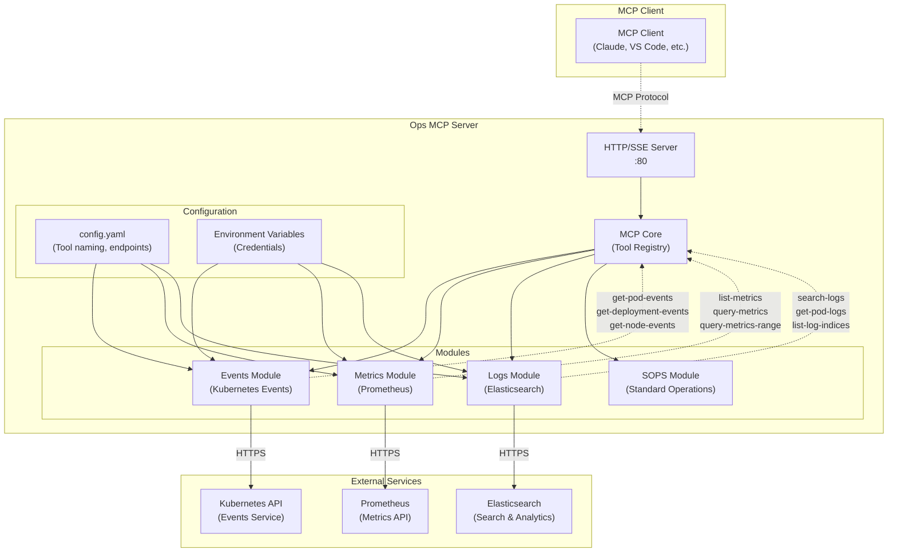

# Ops MCP Server

A Model Context Protocol (MCP) server for operations tools, including event, metrics, log management, and standard operation procedures (SOPS) capabilities.

## Project Overview

Ops MCP Server is a Go-based MCP server that provides operations data query capabilities for AI assistants (such as Claude, VS Code, etc.). Through the unified MCP protocol, AI assistants can directly query Kubernetes events, Prometheus metrics, Elasticsearch logs, and execute standard operation procedures (SOPS).

### Architecture Diagram



## Features

### Core Modules

- **🎯 Events Module**: Monitor Kubernetes events (pods, deployments, nodes)
- **📊 Metrics Module**: Query Prometheus metrics and monitoring data
- **📋 Logs Module**: Search and analyze logs through Elasticsearch
- **⚙️ SOPS Module**: Execute standard operation procedures for infrastructure management

### Supported Tools

The server provides the following configurable MCP tools:

#### Events Tools

- `get-pod-events` - Get Kubernetes events from all pods in specified namespace/cluster
- `get-deployment-events` - Get Kubernetes events from all deployments in specified namespace/cluster
- `get-node-events` - Get Kubernetes events from all nodes in specified cluster

#### Metrics Tools

- `list-metrics` - List all available metrics from Prometheus
- `query-metrics` - Execute instant PromQL queries
- `query-metrics-range` - Execute PromQL range queries over time periods

#### Logs Tools

- `search-logs` - Full-text search across log messages
- `list-log-indices` - List all indices in the Elasticsearch cluster
- `get-pod-logs` - Query logs for specific Kubernetes pods

#### SOPS Tools

- `execute-sops` - Execute standard operation procedures (SOPS) for infrastructure management

### Tool Naming Convention

Tools use a consistent naming convention with **hyphens** as separators:

- **Format**: `{prefix}{verb-noun-context}{suffix}`
- **Examples**: `get-pod-events`, `list-metrics`, `search-logs`
- **Configurable**: Prefix and suffix can be customized for each module

## Configuration

Configure the server using a YAML file (default path: `configs/config.yaml`):

```yaml
# Logging configuration
log:
  level: info # Log level: debug, info, warn, error

# Server configuration
server:
  host: 0.0.0.0 # Server binding address
  port: 80 # Server port
  mode: sse # Server mode: stdio or sse

# Events module configuration
events:
  enabled: true # Whether to enable events module
  endpoint: "https://ops-server.your-company.com/api/v1/events" # Events API endpoint
  token: "${EVENTS_TOKEN}" # API token (supports environment variables)
  tools:
    prefix: "" # Tool name prefix
    suffix: "-provided-by-nats" # Tool name suffix

# Metrics module configuration
metrics:
  enabled: true # Whether to enable metrics module
  tools:
    prefix: "" # Tool name prefix
    suffix: "-provided-by-prometheus" # Tool name suffix
  prometheus:
    endpoint: "https://prometheus.your-company.com/api/v1" # Prometheus API endpoint
    timeout: 30 # Request timeout (seconds)

# Logs module configuration
logs:
  enabled: true # Whether to enable logs module
  tools:
    prefix: "" # Tool name prefix
    suffix: "-provided-by-elasticsearch" # Tool name suffix
  elasticsearch:
    endpoint: "https://elasticsearch.your-company.com:9200" # Elasticsearch endpoint
    username: "${LOGS_LOGS_ELASTICSEARCH_USERNAMENAME}" # Username (supports environment variables)
    password: "${LOGS_LOGS_ELASTICSEARCH_PASSWORD}" # Password (supports environment variables)
    timeout: 30 # Request timeout (seconds)

# SOPS module configuration
sops:
  enabled: true # Whether to enable SOPS module
  endpoint: "https://ops-server.your-company.com" # SOPS API endpoint
  token: "${SOPS_TOKEN}" # API token (supports environment variables)
  tools:
    prefix: "" # Tool name prefix
    suffix: "-provided-by-sops" # Tool name suffix
```

### Environment Variables

Set the following environment variables in production:

```bash
# Events API configuration
export EVENTS_TOKEN="your-events-api-token"

# SOPS API configuration
export SOPS_TOKEN="your-sops-api-token"

# Elasticsearch configuration
export LOGS_LOGS_ELASTICSEARCH_USERNAMENAME="elastic"
export LOGS_LOGS_ELASTICSEARCH_PASSWORD="your-elasticsearch-password"


# Optional: Prometheus authentication
# export PROMETHEUS_TOKEN="your-prometheus-token"

# Server configuration
export SERVER_HOST="0.0.0.0"
export SERVER_PORT="80"
export LOG_LEVEL="info"
```

### Tool Name Configuration Examples

With the above configuration, the actual tool names will be:

#### Events Tools

- `get-pod-events-provided-by-nats`
- `get-deployment-events-provided-by-nats`
- `get-node-events-provided-by-nats`

#### Metrics Tools

- `list-metrics-provided-by-prometheus`
- `query-metrics-provided-by-prometheus`
- `query-metrics-range-provided-by-prometheus`

#### Logs Tools

- `search-logs-provided-by-elasticsearch`
- `list-log-indices-provided-by-elasticsearch`
- `get-pod-logs-provided-by-elasticsearch`

#### SOPS Tools

- `execute-sops-provided-by-sops`

To use default tool names (no prefix/suffix), set both `prefix` and `suffix` to empty strings `""`.

## Usage Guide

### Tool Call Examples

You can call tools with parameters (using the actual configured tool names):

```javascript
// Execute metrics query
const result = await mcpClient.callTool(
  "query-metrics-provided-by-prometheus",
  {
    query: "count by (cluster) (up)",
  }
);

// Get Pod events
const events = await mcpClient.callTool("get-pod-events-provided-by-nats", {
  cluster: "production",
  namespace: "ai-nlp-fcheck",
  limit: "20",
});

// Search logs
const logs = await mcpClient.callTool("search-logs-provided-by-elasticsearch", {
  search_term: "error",
  limit: "50",
  time_range: "1h",
});

// Execute SOPS procedure
const sopsResult = await mcpClient.callTool("execute-sops-provided-by-sops", {
  sops_id: "deploy-application",
  parameters: '{"app_name": "my-app", "version": "v1.2.3"}',
  timeout: "30m",
});
```

### Claude Desktop Integration Example

Using this MCP server in Claude Desktop:

```json
{
  "mcpServers": {
    "ops-mcp-server": {
      "command": "docker",
      "args": [
        "run",
        "--rm",
        "-i",
        "--env",
        "EVENTS_TOKEN=your-token",
        "--env",
        "LOGS_LOGS_ELASTICSEARCH_USERNAMENAME=elastic",
        "--env",
        "LOGS_LOGS_ELASTICSEARCH_PASSWORD=your-password",
        "shaowenchen/ops-mcp-server:latest",
        "--enable-events",
        "--enable-metrics",
        "--enable-logs"
      ]
    }
  }
}
```

## Running the Server

### Docker Container (Recommended)

#### Docker Quick Start

```bash
# Run with default configuration
docker run -d \
  --name ops-mcp-server \
  -p 80:80 \
  -e EVENTS_TOKEN="your-events-api-token" \
  -e SOPS_TOKEN="your-sops-api-token" \
  -e LOGS_ELASTICSEARCH_USERNAME="elastic" \
  -e LOGS_ELASTICSEARCH_PASSWORD="your-elasticsearch-password" \
  shaowenchen/ops-mcp-server:latest \
  --mode=sse --enable-events --enable-metrics --enable-logs --enable-sops
```

#### Docker with Custom Configuration

```bash
# Run with custom configuration file
docker run -d \
  --name ops-mcp-server \
  -p 80:80 \
  -v $(pwd)/configs/config.yaml:/runtime/configs/config.yaml \
  -e EVENTS_TOKEN="your-events-api-token" \
  -e SOPS_TOKEN="your-sops-api-token" \
  -e LOGS_ELASTICSEARCH_USERNAME="elastic" \
  -e LOGS_ELASTICSEARCH_PASSWORD="your-elasticsearch-password" \
  shaowenchen/ops-mcp-server:latest \
  --config=./configs/config.yaml --mode=sse
```

#### Docker Compose Deployment

```yaml
version: "3.8"
services:
  ops-mcp-server:
    image: shaowenchen/ops-mcp-server:latest
    ports:
      - "80:80"
    environment:
      - OPS_MCP_ENV=production
      - OPS_MCP_LOG_LEVEL=info
      - EVENTS_TOKEN=${EVENTS_TOKEN}
      - SOPS_TOKEN=${SOPS_TOKEN}
      - LOGS_ELASTICSEARCH_USERNAME=${LOGS_ELASTICSEARCH_USERNAME}
      - LOGS_ELASTICSEARCH_PASSWORD=${LOGS_ELASTICSEARCH_PASSWORD}
    command:
      [
        "--mode=sse",
        "--enable-events",
        "--enable-metrics",
        "--enable-logs",
        "--enable-sops",
      ]
    healthcheck:
      test:
        [
          "CMD",
          "wget",
          "--no-verbose",
          "--tries=1",
          "--spider",
          "http://localhost:80/healthz",
        ]
      interval: 30s
      timeout: 3s
      retries: 3
    restart: unless-stopped
    volumes:
      - ./configs:/runtime/configs:ro # Mount configuration files (optional)
```

### Local Development

#### Build from Source

```bash
# Clone the project
git clone https://github.com/shaowenchen/ops-mcp-server.git
cd ops-mcp-server

# Install dependencies
make dev-setup

# Build the project
make build

# Run server (stdio mode, for MCP clients)
./bin/ops-mcp-server --enable-events --enable-metrics --enable-logs --enable-sops

# Run server (SSE mode, for HTTP API)
./bin/ops-mcp-server --mode=sse --enable-events --enable-metrics --enable-logs --enable-sops
```

#### Using Makefile

```bash
# Quick development cycle
make quick  # Format, check, test, build

# Run specific modules
make run-events    # Run events module only
make run-metrics   # Run metrics module only
make run-logs      # Run logs module only
make run-all       # Run all modules

# Test MCP functionality
make test-mcp
```

### Kubernetes Deployment

#### Quick Deployment

```bash
# Build and deploy to Kubernetes
make k8s-build-deploy

# Or execute step by step
make docker-build docker-push k8s-deploy
```

#### Check Deployment Status

```bash
# Check deployment status
make k8s-status

# View application logs
make k8s-logs

# Clean up resources
make k8s-cleanup
```

### Server Modes

#### SSE Mode (Server-Sent Events)

SSE mode is suitable for web-based clients and HTTP API access:

```bash
# Access server: http://localhost:80
# Health check endpoint: http://localhost:80/healthz
# MCP endpoint: http://localhost:80/mcp
```

Health check response example:

```json
{
  "status": "ok",
  "service": "ops-mcp-server",
  "version": "1.0.0",
  "timestamp": "2024-01-20T10:30:00Z",
  "mode": "sse",
  "modules": {
    "events": true,
    "metrics": true,
    "logs": true
  },
  "tools_count": 9
}
```

#### STDIO Mode

STDIO mode is suitable for direct MCP client integration (such as Claude Desktop):

```bash
./ops-mcp-server --enable-events --enable-metrics --enable-logs
```

### Command Line Options

```bash
# Basic options
--mode            # Server mode (stdio|sse, default: stdio)
--config          # Configuration file path (default: configs/config.yaml)
--host            # Server host (default: 0.0.0.0)
--port            # Server port (default: 80)
--log-level       # Log level (debug|info|warn|error, default: info)

# Module switches
--enable-events   # Enable events module
--enable-metrics  # Enable metrics module
--enable-logs     # Enable logs module
--enable-sops     # Enable SOPS module

# Usage example
./ops-mcp-server --mode=sse --enable-events --enable-metrics --enable-logs --enable-sops --port=8080 --log-level=debug
```

## Development Guide

### Project Structure

```
ops-mcp-server/
├── cmd/server/           # Main program entry
├── pkg/
│   ├── config/          # Configuration structure definitions
│   ├── modules/         # Business modules
│   │   ├── events/      # Events module
│   │   ├── metrics/     # Metrics module
│   │   └── logs/        # Logs module
│   └── server/          # Server configuration
├── configs/             # Configuration files
├── deploy/              # Deployment configuration
├── bin/                 # Build output
└── vendor/              # Go dependencies
```

### Build and Test

```bash
# Complete test and build
make all

# Multi-platform build
make build-all

# Run tests
make test

# Generate test coverage report
make test-coverage

# Code check and format
make lint fmt
```

## Troubleshooting

### Common Issues

1. **Tool not found**: Check if the module is enabled and if the tool name in the configuration file is correct
2. **Connection timeout**: Verify network connectivity to external services (Prometheus, Elasticsearch)
3. **Authentication failure**: Confirm that authentication information in environment variables is correct
4. **Port conflict**: Use `--port` parameter to specify another port

### Debug Mode

```bash
# Enable debug logging
./ops-mcp-server --log-level=debug --enable-events --enable-metrics --enable-logs --enable-sops

# View detailed request logs
export LOG_LEVEL=debug
docker run -e LOG_LEVEL=debug shaowenchen/ops-mcp-server:latest
```

## Contributing

1. Fork the project
2. Create a feature branch (`git checkout -b feature/amazing-feature`)
3. Commit your changes (`git commit -m 'Add some amazing feature'`)
4. Push to the branch (`git push origin feature/amazing-feature`)
5. Open a Pull Request

### Development Environment Setup

```bash
# Set up development environment
make dev-setup

# Run pre-commit checks
make quick
```

## License

This project is licensed under the MIT License - see the LICENSE file for details.

## Support and Feedback

- 🐛 [Report Bugs](https://github.com/shaowenchen/ops-mcp-server/issues)
- 💡 [Feature Requests](https://github.com/shaowenchen/ops-mcp-server/issues)
- 📖 [Documentation](https://github.com/shaowenchen/ops-mcp-server/wiki)
- 📧 Email: mail@chenshaowen.com

---

**✨ Let AI assistants directly access your operations data to improve operational efficiency!**
