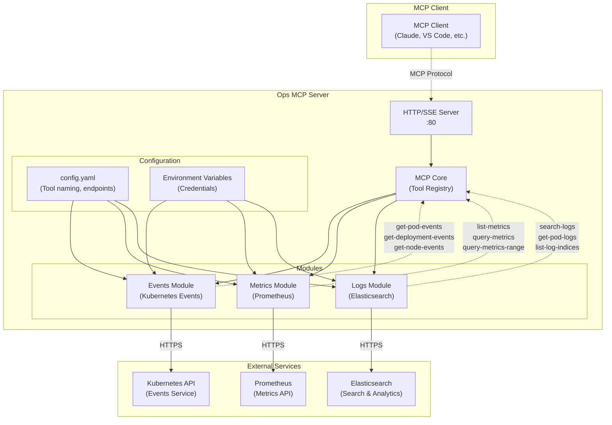

# Ops MCP Server

一个用于运维工具的模型上下文协议（MCP）服务器，包括事件、指标和日志管理功能。

## 项目概览

Ops MCP Server 是一个基于Go语言开发的MCP服务器，为AI助手（如Claude、VS Code等）提供运维数据查询能力。通过统一的MCP协议，AI助手可以直接查询Kubernetes事件、Prometheus指标和Elasticsearch日志。

### 架构图



## 功能特性

### 核心模块

- **🎯 Events Module（事件模块）**: 监控Kubernetes事件（pods、deployments、nodes）
- **📊 Metrics Module（指标模块）**: 查询Prometheus指标和监控数据  
- **📋 Logs Module（日志模块）**: 通过Elasticsearch搜索和分析日志

### 支持的工具

服务器提供以下可配置命名的MCP工具：

#### 事件工具 (Events Tools)

- `get-pod-events` - 获取指定命名空间/集群中所有Pod的Kubernetes事件
- `get-deployment-events` - 获取指定命名空间/集群中所有Deployment的Kubernetes事件
- `get-node-events` - 获取指定集群中所有Node的Kubernetes事件

#### 指标工具 (Metrics Tools)

- `list-metrics` - 列出Prometheus中所有可用指标
- `query-metrics` - 执行即时PromQL查询
- `query-metrics-range` - 在时间范围内执行PromQL查询

#### 日志工具 (Logs Tools)

- `search-logs` - 全文搜索日志消息
- `list-log-indices` - 列出Elasticsearch集群中的所有索引
- `get-pod-logs` - 查询特定Kubernetes Pod的日志

### 工具命名规范

工具使用一致的命名规范，以**连字符**作为分隔符：

- **格式**: `{prefix}{verb-noun-context}{suffix}`
- **示例**: `get-pod-events`, `list-metrics`, `search-logs`
- **可配置**: 每个模块的前缀和后缀都可以自定义

## 配置说明

使用YAML文件配置服务器（默认路径：`configs/config.yaml`）：

```yaml
# 日志配置
log:
  level: info  # 日志级别: debug, info, warn, error

# 服务器配置
server:
  host: 0.0.0.0    # 服务器绑定地址
  port: 80         # 服务器端口
  mode: sse        # 服务器模式: stdio 或 sse

# 事件模块配置
events:
  enabled: true    # 是否启用事件模块
  endpoint: "https://ops-server.your-company.com/api/v1/events"  # 事件API端点
  token: "${EVENTS_API_TOKEN}"  # API令牌（支持环境变量）
  tools:
    prefix: ""     # 工具名称前缀
    suffix: "-provided-by-nats"  # 工具名称后缀

# 指标模块配置
metrics:
  enabled: true    # 是否启用指标模块
  tools:
    prefix: ""     # 工具名称前缀
    suffix: "-provided-by-prometheus"  # 工具名称后缀
  prometheus:
    endpoint: "https://prometheus.your-company.com/api/v1"  # Prometheus API端点
    timeout: 30    # 请求超时时间（秒）

# 日志模块配置
logs:
  enabled: true    # 是否启用日志模块
  tools:
    prefix: ""     # 工具名称前缀
    suffix: "-provided-by-elasticsearch"  # 工具名称后缀
  elasticsearch:
    endpoint: "https://elasticsearch.your-company.com:9200"  # Elasticsearch端点
    username: "${ELASTICSEARCH_USER}"      # 用户名（支持环境变量）
    password: "${ELASTICSEARCH_PASSWORD}"  # 密码（支持环境变量）
    timeout: 30    # 请求超时时间（秒）
```

### 环境变量配置

在生产环境中设置以下环境变量：

```bash
# 事件API配置
export EVENTS_API_TOKEN="your-events-api-token"

# Elasticsearch配置
export ELASTICSEARCH_USER="elastic"
export ELASTICSEARCH_PASSWORD="your-elasticsearch-password"

# 可选：使用API Key替代用户名密码
# export ELASTICSEARCH_API_KEY="your-api-key"

# 可选：Prometheus认证
# export PROMETHEUS_TOKEN="your-prometheus-token"

# 服务器配置
export SERVER_HOST="0.0.0.0"
export SERVER_PORT="80"
export LOG_LEVEL="info"
```

### 工具名称配置示例

使用上述配置，实际的工具名称将为：

#### 事件工具
- `get-pod-events-provided-by-nats`
- `get-deployment-events-provided-by-nats`
- `get-node-events-provided-by-nats`

#### 指标工具
- `list-metrics-provided-by-prometheus`
- `query-metrics-provided-by-prometheus`
- `query-metrics-range-provided-by-prometheus`

#### 日志工具
- `search-logs-provided-by-elasticsearch`
- `list-log-indices-provided-by-elasticsearch`
- `get-pod-logs-provided-by-elasticsearch`

要使用默认工具名称（无前缀/后缀），请将`prefix`和`suffix`都设置为空字符串`""`。

## 使用指南

### 工具调用示例

可以使用参数调用工具（使用实际配置的工具名称）：

```javascript
// 执行指标查询
const result = await mcpClient.callTool(
  "query-metrics-provided-by-prometheus",
  {
    query: "count by (cluster) (up)",
  }
);

// 获取Pod事件
const events = await mcpClient.callTool(
  "get-pod-events-provided-by-nats",
  {
    cluster: "production",
    namespace: "ai-nlp-fcheck",
    limit: "20",
  }
);

// 搜索日志
const logs = await mcpClient.callTool(
  "search-logs-provided-by-elasticsearch",
  {
    search_term: "error",
    limit: "50",
    time_range: "1h"
  }
);
```

### Claude Desktop集成示例

在Claude Desktop中使用此MCP服务器：

```json
{
  "mcpServers": {
    "ops-mcp-server": {
      "command": "docker",
      "args": [
        "run", "--rm", "-i",
        "--env", "EVENTS_API_TOKEN=your-token",
        "--env", "ELASTICSEARCH_USER=elastic", 
        "--env", "ELASTICSEARCH_PASSWORD=your-password",
        "shaowenchen/ops-mcp-server:latest",
        "--enable-events", "--enable-metrics", "--enable-logs"
      ]
    }
  }
}
```

## 运行服务器

### Docker容器（推荐）

#### Docker快速启动

```bash
# 使用默认配置运行
docker run -d \
  --name ops-mcp-server \
  -p 80:80 \
  -e EVENTS_API_TOKEN="your-events-api-token" \
  -e ELASTICSEARCH_USER="elastic" \
  -e ELASTICSEARCH_PASSWORD="your-elasticsearch-password" \
  shaowenchen/ops-mcp-server:latest \
  --mode=sse --enable-events --enable-metrics --enable-logs
```

#### 使用自定义配置的Docker

```bash
# 使用自定义配置文件运行
docker run -d \
  --name ops-mcp-server \
  -p 80:80 \
  -v $(pwd)/configs/config.yaml:/runtime/configs/config.yaml \
  -e EVENTS_API_TOKEN="your-events-api-token" \
  -e ELASTICSEARCH_USER="elastic" \
  -e ELASTICSEARCH_PASSWORD="your-elasticsearch-password" \
  shaowenchen/ops-mcp-server:latest \
  --config=./configs/config.yaml --mode=sse
```

#### Docker Compose部署

```yaml
version: "3.8"
services:
  ops-mcp-server:
    image: shaowenchen/ops-mcp-server:latest
    ports:
      - "80:80"
    environment:
      - OPS_MCP_ENV=production
      - OPS_MCP_LOG_LEVEL=info
      - EVENTS_API_TOKEN=${EVENTS_API_TOKEN}
      - ELASTICSEARCH_USER=${ELASTICSEARCH_USER}
      - ELASTICSEARCH_PASSWORD=${ELASTICSEARCH_PASSWORD}
    command:
      ["--mode=sse", "--enable-events", "--enable-metrics", "--enable-logs"]
    healthcheck:
      test:
        [
          "CMD",
          "wget",
          "--no-verbose",
          "--tries=1",
          "--spider",
          "http://localhost:80/healthz",
        ]
      interval: 30s
      timeout: 3s
      retries: 3
    restart: unless-stopped
    volumes:
      - ./configs:/runtime/configs:ro  # 挂载配置文件（可选）
```

### 本地开发运行

#### 从源码构建

```bash
# 克隆项目
git clone https://github.com/shaowenchen/ops-mcp-server.git
cd ops-mcp-server

# 安装依赖
make dev-setup

# 构建项目
make build

# 运行服务器（stdio模式，适用于MCP客户端）
./bin/ops-mcp-server --enable-events --enable-metrics --enable-logs

# 运行服务器（SSE模式，适用于HTTP API）
./bin/ops-mcp-server --mode=sse --enable-events --enable-metrics --enable-logs
```

#### 使用Makefile

```bash
# 快速开发周期
make quick  # 格式化、检查、测试、构建

# 运行特定模块
make run-events    # 仅运行事件模块
make run-metrics   # 仅运行指标模块  
make run-logs      # 仅运行日志模块
make run-all       # 运行所有模块

# 测试MCP功能
make test-mcp
```

### Kubernetes部署

#### 快速部署

```bash
# 构建并部署到Kubernetes
make k8s-build-deploy

# 或者分步骤执行
make docker-build docker-push k8s-deploy
```

#### 查看部署状态

```bash
# 检查部署状态
make k8s-status

# 查看应用日志
make k8s-logs

# 清理资源
make k8s-cleanup
```

### 服务器模式

#### SSE模式（Server-Sent Events）

SSE模式适用于基于Web的客户端和HTTP API访问：

```bash
# 访问服务器：http://localhost:80
# 健康检查端点：http://localhost:80/healthz
# MCP端点：http://localhost:80/mcp
```

健康检查响应示例：
```json
{
  "status": "ok",
  "service": "ops-mcp-server", 
  "version": "1.0.0",
  "timestamp": "2024-01-20T10:30:00Z",
  "mode": "sse",
  "modules": {
    "events": true,
    "metrics": true,
    "logs": true
  },
  "tools_count": 9
}
```

#### STDIO模式

STDIO模式适用于直接的MCP客户端集成（如Claude Desktop）：

```bash
./ops-mcp-server --enable-events --enable-metrics --enable-logs
```

### 命令行选项

```bash
# 基本选项
--mode            # 服务器模式 (stdio|sse, 默认: stdio)
--config          # 配置文件路径 (默认: configs/config.yaml) 
--host            # 服务器主机 (默认: 0.0.0.0)
--port            # 服务器端口 (默认: 80)
--log-level       # 日志级别 (debug|info|warn|error, 默认: info)

# 模块开关
--enable-events   # 启用事件模块
--enable-metrics  # 启用指标模块
--enable-logs     # 启用日志模块

# 使用示例
./ops-mcp-server --mode=sse --enable-all --port=8080 --log-level=debug
```

## 开发指南

### 项目结构

```
ops-mcp-server/
├── cmd/server/           # 主程序入口
├── pkg/
│   ├── config/          # 配置结构定义
│   ├── modules/         # 业务模块
│   │   ├── events/      # 事件模块
│   │   ├── metrics/     # 指标模块  
│   │   └── logs/        # 日志模块
│   └── server/          # 服务器配置
├── configs/             # 配置文件
├── deploy/              # 部署配置
├── bin/                 # 构建输出
└── vendor/              # Go依赖包
```

### 构建和测试

```bash
# 完整测试和构建
make all

# 多平台构建
make build-all

# 运行测试
make test

# 生成测试覆盖率报告
make test-coverage

# 代码检查和格式化
make lint fmt
```

## 故障排除

### 常见问题

1. **工具未找到**: 检查模块是否已启用，配置文件中工具名称是否正确
2. **连接超时**: 验证外部服务（Prometheus、Elasticsearch）的网络连接性
3. **认证失败**: 确认环境变量中的认证信息是否正确
4. **端口冲突**: 使用`--port`参数指定其他端口

### 调试模式

```bash
# 启用调试日志
./ops-mcp-server --log-level=debug --enable-events --enable-metrics --enable-logs

# 查看详细请求日志
export LOG_LEVEL=debug
docker run -e LOG_LEVEL=debug shaowenchen/ops-mcp-server:latest
```

## 贡献指南

1. Fork项目
2. 创建功能分支 (`git checkout -b feature/amazing-feature`)
3. 提交更改 (`git commit -m 'Add some amazing feature'`)
4. 推送到分支 (`git push origin feature/amazing-feature`)
5. 打开Pull Request

### 开发环境设置

```bash
# 设置开发环境
make dev-setup

# 运行pre-commit检查
make quick
```

## 许可证

本项目采用MIT许可证 - 查看LICENSE文件了解详情。

## 支持和反馈

- 🐛 [报告Bug](https://github.com/shaowenchen/ops-mcp-server/issues)
- 💡 [功能请求](https://github.com/shaowenchen/ops-mcp-server/issues)
- 📖 [文档](https://github.com/shaowenchen/ops-mcp-server/wiki)
- 📧 Email: mail@chenshaowen.com

---

**✨ 让AI助手直接访问您的运维数据，提升运维效率！**
